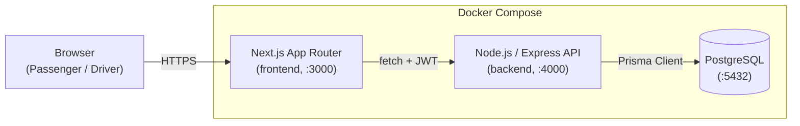

# Architecture

## High-level diagram



- **Browser** talks only to the Next.js frontend (which is itself just a static/SSR
  client — it holds no business logic and no direct DB access).
- **Frontend** calls the backend's REST API over `fetch`, attaching a JWT it got
  at login. All UI state (ride status, pool membership) is derived from what the
  API returns; the frontend polls every few seconds for live updates (see
  §Trade-offs below — no WebSockets in the MVP).
- **Backend** is a single Express app. All business logic — auth, fare
  calculation, pooling/matching, state transitions, capacity enforcement —
  lives here, not in the frontend and not in the database (beyond FK/type
  constraints).
- **Database** is the single source of truth. Money, seat counts, and status
  history all live in Postgres so a restart of the API never loses state.

No microservices, no message queue, no Redis, no Kubernetes — a single
Express monolith and a single Postgres instance are the right size for an
MVP evaluated on engineering judgment, not infrastructure theater (PRD §9).

## Why this stack specifically

| Choice | Realistic alternatives | Why this fits a ride-pooling MVP | What would make us switch |
|---|---|---|---|
| **Next.js (App Router)** | Plain React + React Router, Remix | PRD mandates React/Next; App Router gives file-based routing for 3 pages (`/`, `/passenger`, `/driver`) with zero extra config | If we needed heavy SSR/SEO (we don't — this is behind login) |
| **Express** | NestJS, Fastify | Smallest surface area to *explain line-by-line* in an interview; NestJS's DI/decorators would be overhead for ~10 endpoints | If the API grew past ~30-40 endpoints or needed strict module boundaries |
| **PostgreSQL** | MySQL, SQLite | Relational integrity matters here (FKs between users/vehicles/pools/rides, atomic capacity updates); Postgres's `RETURNING` clause is what makes our concurrency fix a one-liner | If we needed heavy geospatial queries at scale, we'd add PostGIS (same engine) |
| **Prisma** | TypeORM, Knex, raw `pg` | Type-safe schema-as-code, `migrate deploy` fits Docker's non-interactive boot, seed scripts are trivial | If we needed very fine-grained raw-SQL control everywhere (we already drop to raw SQL for the one query that needs it — see below) |
| **JWT (jsonwebtoken)** | Session cookies + Redis store | Stateless — no session store needed, which matters because we deliberately have no Redis in this MVP | If we needed instant server-side revocation of a specific token |
| **Jest + Supertest** | Mocha/Chai, Vitest | Zero-config for a Node/Express app, industry-standard | — |

## Concurrency: the last-seat problem (PRD §14)

**Scenario:** Bullet has 1 seat left. Nusrat and Shirin both hit "accept" at
nearly the same instant; both read "1 seat available" before either writes.

**Naive (wrong) approach:** read `seatsOccupied`, check `< capacity` in
application code, then write `seatsOccupied + 1`. Two concurrent requests can
both pass the check before either writes — classic race condition, capacity
gets exceeded.

**Our approach:** a single atomic, conditional SQL statement
(`backend/src/services/pool.service.js::tryClaimSeats`):

```sql
UPDATE pools
SET "seatsOccupied" = "seatsOccupied" + $seats
WHERE id = $poolId
  AND "seatsOccupied" + $seats <= (SELECT capacity FROM vehicles WHERE ...)
RETURNING id;
```

Postgres executes this whole statement atomically under the hood (row-level
lock is taken and released within the single `UPDATE`). Two concurrent
transactions racing for the same row cannot both succeed: the database
serializes them, the first commits and increments `seatsOccupied`, the second
re-evaluates the `WHERE` clause against the now-updated row and affects zero
rows. Our code checks `rows.length > 0` — the loser gets a `409 Capacity
Exceeded` instead of a false "success". This is exercised directly in
`backend/tests/rides.integration.test.js` by firing both accepts with
`Promise.all`.

**At larger scale** (see `docs/SCALING.md`), this pattern (an atomic
conditional UPDATE) still works fine on a single Postgres primary up to a
fairly high write rate. Beyond that we'd move seat-claiming into a dedicated
reservation service backed by a fast key-value store (e.g. Redis with
`WATCH`/Lua scripts, or a proper distributed lock) to take the write load off
the primary — but that's genuinely not needed at this scale, so we didn't
build it (PRD §9: don't add complexity without a reason).

## Trade-offs

- **Polling, not WebSockets** — the frontend re-fetches every 4s. Simpler to
  build/explain/test than a socket layer; fine for a handful of concurrent
  users in an MVP. We'd move to SSE/WebSockets once "does the driver see the
  passenger cancel within 4 seconds" actually matters to users.
- **Zone-based matching, not real geodistance** — deliberate per PRD §4.
- **Single vehicle per driver** — documented in `docs/ASSUMPTIONS.md`.
