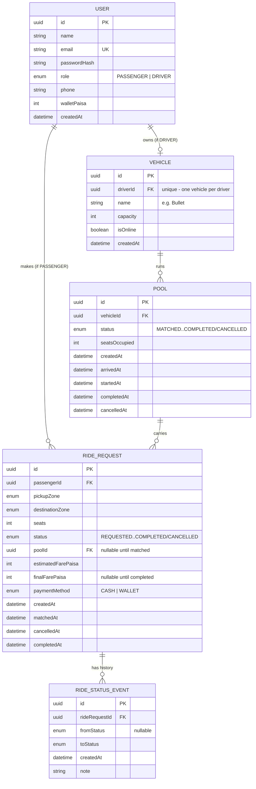

# Entity-Relationship Diagram

## Why this shape

- `Vehicle.driverId` is `@unique` — one driver owns exactly one vehicle in
  this MVP (documented assumption, see `docs/ASSUMPTIONS.md`).
- `Pool` is the "trip" — it exists independently of any one passenger so that
  a second, third passenger can attach to it later (`RideRequest.poolId` is
  nullable and set once a driver accepts).
- Money (`estimatedFarePaisa`, `finalFarePaisa`, `walletPaisa`) is **integer
  paisa everywhere** — never a `DECIMAL`/`FLOAT` — see
  `docs/FARE_AND_MATCHING.md` for why.
- `RideStatusEvent` is append-only and never updated or deleted — it's the
  audit trail the PRD asks for ("hold onto enough history to explain exactly
  what happened, in case anyone asks later").
- Indexes: `ride_requests(passengerId)` and `(poolId)`, and
  `ride_status_events(rideRequestId)` — the three lookups the API actually
  does on every request (a passenger's own rides, a pool's members, a ride's
  history).
