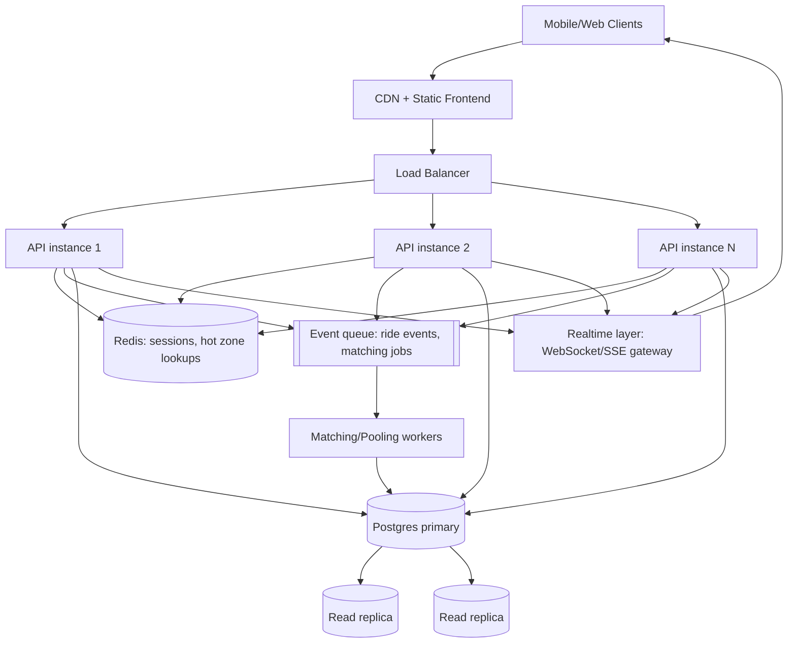

# Bonus: Scaling to 1M Passengers / 100k Drivers ("If Oi Tesla Goes Viral")

Reasoning through what would actually break first and what we'd change —
without over-building the MVP now (PRD §9/§12 bonus).

**Load balancing / horizontal scaling** — the Express API is already
stateless (JWT, no in-memory session), so we can run N instances behind a
load balancer with zero code changes; only the DB connection pool sizing
needs tuning.

**DB indexing / read replicas** — today's indexes (`passengerId`, `poolId`,
`rideRequestId`) cover MVP query patterns. At scale we'd add a composite
index on `(status, pickupZone)` for the driver's "open requests" query, and
route read-heavy queries (ride history, driver dashboards) to replicas,
keeping the primary for writes and the seat-claim transaction.

**Caching** — zone list and hop-distance table are static; cache them at the
edge/CDN. Per-vehicle "is this driver online" is a good Redis cache
candidate to avoid hammering Postgres on every dispatch-board poll.

**Geospatial search** — swap the zone/hop-distance model for PostGIS
(`ST_DWithin`) or a geo-index service (e.g. Uber's H3) once real lat/lng
matching matters; the `isCompatible`/`hopDistance` functions are already
isolated behind a small interface in `zones.js`, so this is a localized
change, not a rewrite.

**Queues/events** — move "find a compatible pool for this new request" off
the request/response path and into an async matching worker consuming a
queue (SQS/Kafka/RabbitMQ). This also naturally batches concurrent
requests instead of racing them one at a time against the DB.

**Real-time communication** — replace 4-second polling with WebSocket/SSE
push so 1M passengers aren't all re-polling every few seconds; a
pub/sub layer (Redis Pub/Sub or a managed service) fans out ride-status
events to the right connected client.

**Rate limiting / idempotency** — add per-user rate limits on ride
requests/accepts, and idempotency keys on `accept`/`complete` calls so a
retried request (flaky mobile network) can't double-charge a fare or
double-claim a seat.

**Observability** — structured logs + request tracing (already using
`morgan`; swap for structured JSON logs + a tracing header at this scale),
metrics on match latency, pool-fill rate, capacity-claim conflict rate (a
proxy for how often the atomic UPDATE is losing races — a signal to move
to the queue-based matcher above).

**DB contention** — the current atomic-UPDATE approach for seat claiming
works well up to a meaningful write rate on one Postgres primary; the
matching-worker + queue design above is exactly the change we'd make once
that single row (or small set of "hot" pool rows during a rush-hour spike)
becomes the bottleneck.

**Ride matching at scale** — geo-sharded matching workers (e.g. one worker
pool per city zone cluster) so matching for Gulshan doesn't contend with
matching for Mirpur.

**Retry/failure strategy** — exponential backoff + idempotency keys on the
client; a dead-letter queue for matching jobs that fail repeatedly, with
alerting rather than silently dropping ride requests.

**Security** — rate-limited auth endpoints, short-lived JWTs + refresh
tokens instead of today's 7-day token, secrets in a managed vault (not
`.env`) at scale.

**Deployment strategy** — blue/green or rolling deploys behind the load
balancer, DB migrations run as a separate release step (not baked into the
container boot command, which is fine for an MVP but risky at scale if two
instances race to run migrations at once).
